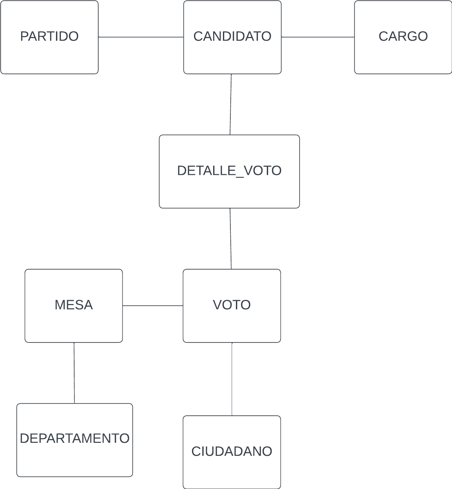
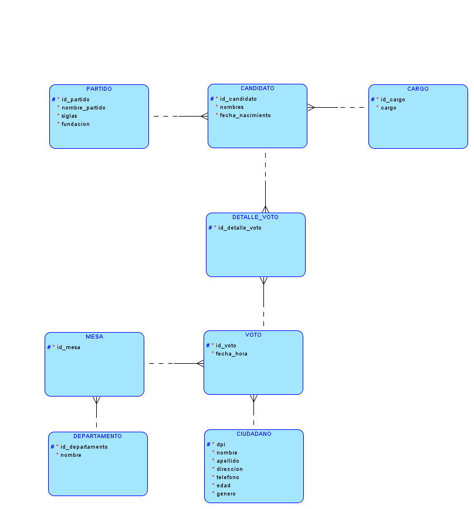
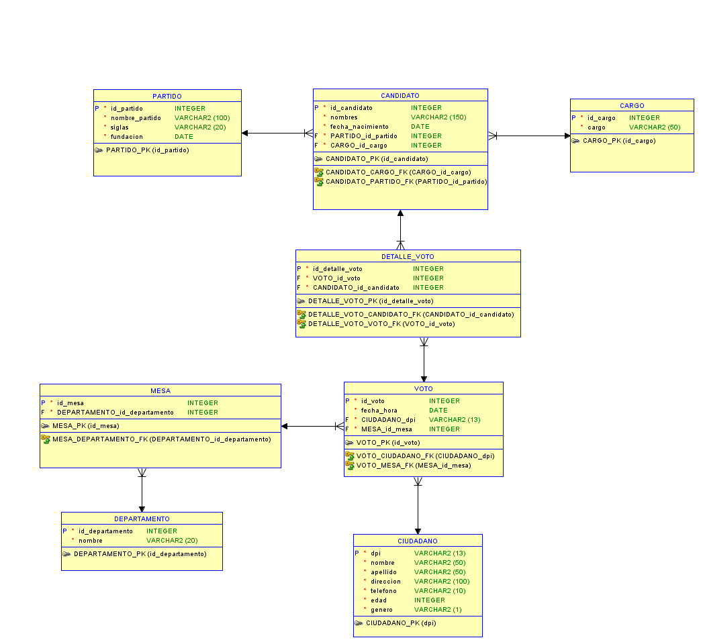

# Proyecto1_SBD1_201504348


# Manual Técnico
### Creacion del modelo Conceptual
El manual técnico muestra en detalle la implementacion de cada una de las fases de la creacion del modelo conceptual, lógico y relacional y de los métodos más importantes en este programa. Empezamos explicando la implementación del modelo conceptual:

Primero debemos identificar las entidades clave que se utilizaran para la creacion del modelo conceptual.
Luego procedemos a ver la relacion que tiene cada entidad entre sí, en esta fase no contemplamos la relacion de uno a muchos o de muchos a muchos ya que en el modelo conceptual solo vemos lo más básico que podamos y asi unir cada entidad lo más simple que podamos.
Luego al ver que la entidad voto se puede normalizar entonces procedemos a separar los datos en esta entidad para crear dos entidades y que los datos no sean repetidos.



### Creacion del modelo Lógico

Para el modelo lógico se utilizó data modeler de oracle para poder realizar el diagrama.

En esta fase se basó en el modelo conceptual como báse ya que en ese modelo tenemos las entidades conectadas entre si de la forma más básica y nos ayuda a visualizar de mejor manera como estan conectadas entre si las entidades.

Empezamos por: 

Partido y Candidato: estas dos entidades estan conectadas entre si y partido puede tener una o mas candidatos mientras que candidato puede tener solo un partido.

Cargo - Candidato: En estas entidades cargo puede tener una o mas candidatos mientras que un candidato tiene solamente un cargo.

Detalle_voto - Candidato: En estas entidades candidato puede tener uno o mas votos mientras que un voto tiene que ir solamente a un candidato.

Detalle_voto - Voto: en este caso esta es la tabla que se normalizó por lo tanto un Voto puede tener un o mas votos mientras que detalle_voto tiene solamente un voto general.

Voto - Mesa: Una mesa puede tener uno o más votos mientras que un voto puede ir solamente a una mesa.

Voto - Ciudadano: Un ciudadano puede ejercer uno o mas votos que se relaciona con la normalizacion de la tabla, recordemos que en la tabla principal sin normalizar vienen varios votos por tanto un voto puede ser emitido solamente por un ciudadano.

Mesa - Departamento: un departamento puede tener una o varias mesas mientras que una mesa puede estar solamente en un departamento

Luego de crear cada entidad y relacionarla entre si necesitamos introducir los datos en este modelo que son los atributos de cada tabla



### Creacion del modelo Relacional

Para la creacion del modelo relacional utilizamos una de las opciones de Data Modeler que se llama aplicar ingenieria y nos da como resultado el modelo relacional que nos da a continuación:



```sql

```
